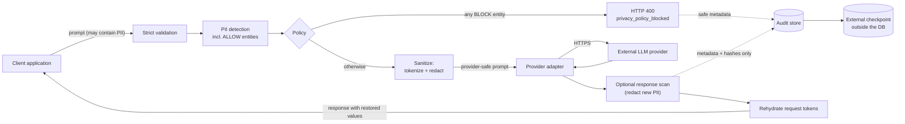
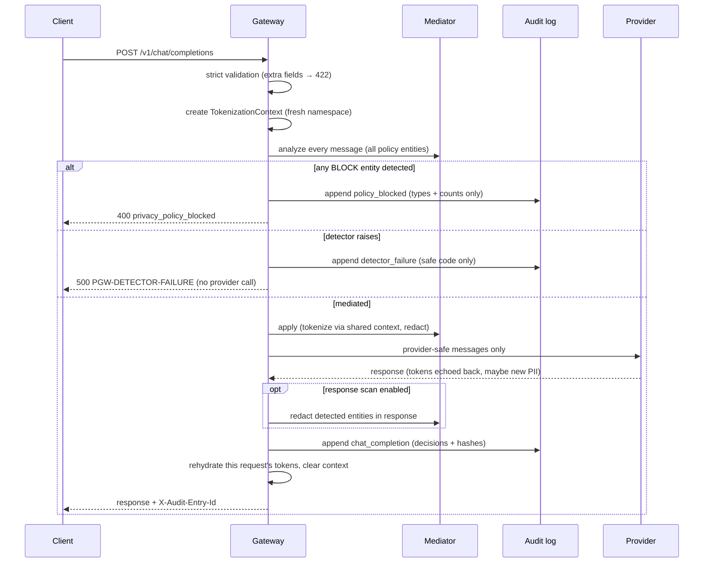

# Architecture

## Component overview

| Component | Module | Responsibility |
|---|---|---|
| API orchestration | `gateway/gateway_api.py` | strict validation, pipeline ordering, fail-closed handling, admin gating |
| PII mediator | `gateway/pii_mediator.py` | detection (Presidio + custom UK NINO recognizer), tokenize/redact application |
| Tokenization context | `gateway/tokenization.py` | request-scoped token minting and exact-match rehydration |
| Policy engine | `gateway/policy.py` | four-action policy, decision records |
| Provider adapters | `gateway/llm_client.py` | wire-format translation, timeouts, typed errors, response normalization |
| Audit logger | `gateway/audit_logger.py` | hash-chained, HMAC-authenticated, concurrency-safe audit records |
| External checkpoint | `gateway/checkpoint.py` | tail-deletion/rollback detection anchor stored outside the DB |
| Configuration | `gateway/config.py` | environment-validated settings, secrets from env only |

Each component is injected into `create_app()` and independently
replaceable (the tests replace every one of them); the gateway pattern
is general-purpose, not a hardcoded pipeline.

## Data flow

The **trust boundary** sits between the provider adapter and the
external LLM provider: everything to the right of it sees only
provider-safe text. The audit store receives only metadata and hashes,
in every path (success, blocked, provider error, detector failure).

## Request processing sequence

## Token lifecycle

1. **Create** — one `TokenizationContext` per API request; its 8-hex
   namespace is random (`secrets`) and checked against the request text.
2. **Mint** — each detected TOKENIZE value gets
   `[[PGW_<ns>_<TYPE>_<n>]]`; the same value in any message of the
   request reuses its token; different values can never share one.
3. **Travel** — only tokens cross the provider boundary; the mapping
   never leaves the request handler's local variable.
4. **Rehydrate** — after the audit record is sealed, exact whole-token
   matches from *this* context are replaced in the response. Unknown,
   forged, partial, or foreign-request tokens pass through unchanged.
5. **Destroy** — the mapping is cleared when the request completes; it
   is never persisted anywhere.

## Audit path

Every request outcome appends exactly one record:

| Event | When | Payload highlights |
|---|---|---|
| `chat_completion` | success | decisions, prompt/response hashes, durations |
| `policy_blocked` | BLOCK entity found | decisions, blocked types; **no prompt hash** (the prompt was never sanitized, and hashing raw PII would enable dictionary confirmation) |
| `provider_error` | adapter failure | safe error code, decisions, prompt hash |
| `detector_failure` | mediation failure | safe error code only |

Records are hash-chained (`prev_hash`) and HMAC-authenticated
(`record_mac`); appends run in a single `BEGIN IMMEDIATE` SQLite
transaction (read predecessor + insert together) so concurrent writers
cannot fork the chain. After each append the configured checkpoint
store receives the newest (id, MAC) pair.

## Failure paths

All failures map to fixed internal codes (`gateway/errors.py`); raw
exception text never reaches API responses, audit records, or logs.

| Failure | Behaviour | Code |
|---|---|---|
| detection/sanitization crash | stop before provider, 500 | `PGW-DETECTOR-FAILURE` |
| policy block | stop before provider, 400 | `privacy_policy_blocked` |
| provider timeout | 504 | `PGW-PROVIDER-TIMEOUT` |
| provider auth | 502 | `PGW-PROVIDER-AUTH` |
| provider malformed/HTTP error | 502 | `PGW-PROVIDER-RESPONSE` |
| audit write failure (success path) | request fails, 500 | `PGW-AUDIT-WRITE` |
| invalid configuration | refuse startup | `PGW-CONFIG-INVALID` |
